# SmartPoi Controls User Manual

*High-level overview of features and user instructions*

> **Note**: This manual provides first-person user instructions for operating the SmartPoi Controls web application. It does not cover technical implementation details.

---

## Table of Contents
1. [Getting Started](#getting-started)
2. [Controls Tab](#controls-tab)
3. [Image Management Tab](#image-management-tab)
4. [Upload Bin Tab](#upload-bin-tab)
5. [Text to POI Tab](#text-to-poi-tab)
6. [File Lists Tab](#file-lists-tab)
7. [About Us Tab](#about-us-tab)
8. [Smart Magic Bridge Tab](#smart-magic-bridge-tab)

---

## Getting Started

### Initial Setup
1. Ensure your POIs (Main and Aux) are powered on and connected to the same Wi-Fi network as your device.
2. Open the SmartPoi Controls web application in your browser.
3. The application will automatically attempt to discover your POIs on the network.

### Interface Overview
The application is organized into seven tabs at the top of the screen:
- **Controls**: Basic POI control and network settings
- **Image Management**: View and manage images on POIs
- **Upload Bin**: Upload and convert images for POI display
- **Text to POI**: Create text-based images and upload to POIs
- **File Lists**: View file lists stored on POIs
- **About Us**: Information about the development partnership
- **Smart Magic Bridge**: Direct ZIP file upload to POIs

---

## Controls Tab
::: {style="display: flex;"}
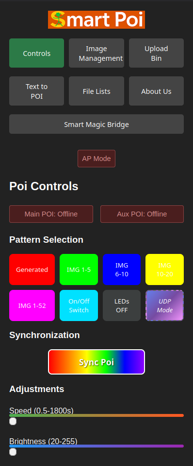{width=45%}
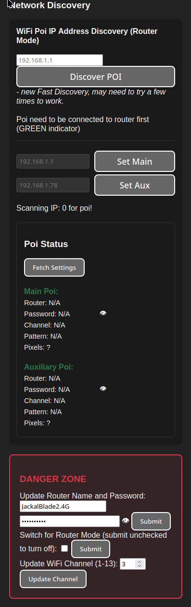{width=45%}
:::

### Pattern Selection
Choose from nine preset patterns to display on your POIs:
1. **Generated** - Algorithmic pattern
2. **IMG 1-5** - Images 1 through 5
3. **IMG 6-10** - Images 6 through 10
4. **IMG 10-20** - Images 10 through 20
5. **IMG 1-52** - All images (1-52)
6. **On/Off Switch** - Toggle patterns 1-5 every time poi starts
7. **LEDs OFF** - Turn off all LEDs
8. **UDP Mode** - Enable UDP control protocol

**How to use**: Click any pattern button to immediately send that pattern to both POIs.

### Synchronization
- **Sync Poi Button**: Click to synchronize the display timing between Main and Aux POIs.

### Adjustments
Use sliders to fine-tune POI behavior:
- **Speed Control**: Adjust display speed from 0.5 to 1800 seconds
(time between image changes)
- **Brightness Control**: Adjust LED brightness from 20 to 255

**How to use**: Drag the sliders left or right. The tooltip shows the current value.

### Network Discovery
Automatically discover POIs on your network using Fast Discovery:
1. Enter your router's IP address (for AP mode choose 192.168.1.1)
2. Click **Discover POI**
3. The system will scan for connected POIs

**Note**: POIs show a GREEN indicator light in Router Mode, Blue/Red for default Access Point mode
**Tip**: Fast Discovery may need to be attempted a few times to work successfully.
### Manual IP Configuration
If automatic discovery fails, manually set IP addresses:
- **Main POI IP**: Enter IP address and click **Set Main**
AP Mode Default: 192.168.1.1
- **Aux POI IP**: Enter IP address and click **Set Aux**
AP Mode Default: 192.168.1.78

### POI Status Display
View current settings for each POI:
- Router name and password (show/hide password option)
- WiFi channel (1-13)
- Active pattern
- Number of pixels detected

**How to use**: Click **Fetch Settings** to update status information.

### Danger Zone
**Warning**: These settings affect POI network configuration:

1. **Update Router Name and Password**:
   - Enter new router SSID and password
   - Click **Submit** to update POI WiFi credentials
   
2. **Router Mode Toggle**:
   - Check/uncheck the box to enable/disable router mode
   - Click **Submit** to apply
   - Note: Poi will now alternate between Router/AP mode on reboot

3. **Update WiFi Channel**:
   - Enter channel number (1-13)
   - Click **Update Channel**

---

## Image Management Tab
::: {style="display: flex;"}
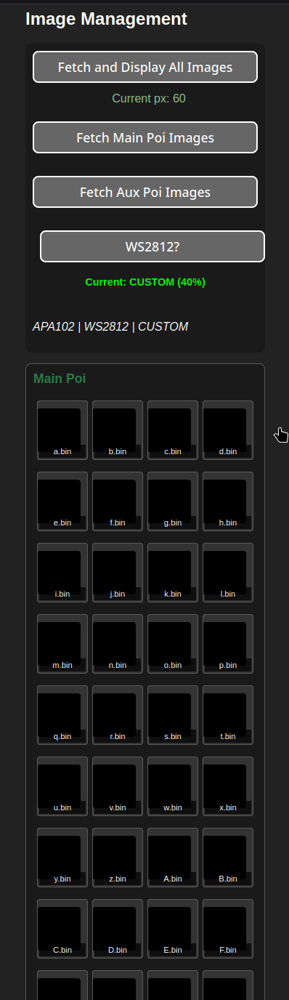{width=45%}
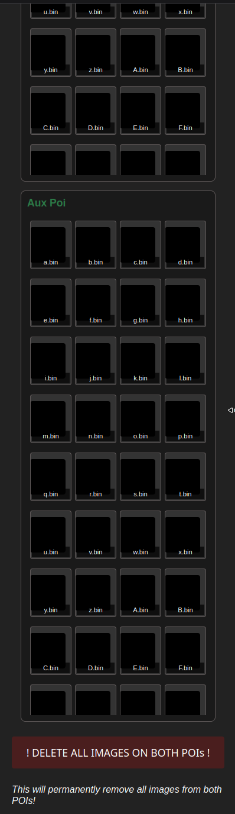{width=45%}
:::
### Fetching Images
- **Fetch and Display All Images**: Retrieves images from both POIs and displays them in grids
- **Fetch Main Poi Images**: Retrieves images only from the Main POI
- **Fetch Aux Poi Images**: Retrieves images only from the Aux POI

### Image Interaction
- **View Enlarged**: Click any image to open it (and display on poi)
- **Long Press/Right-click**: Opens context menu with options:
  - Upload an image to POI
  - Delete image
- **Desktop Browser Drag/Drop**: drag images from file browser onto image placeholder to upload to POI
### Pixel Control
- View current pixel count for each POI (should be fetched from poi automatically)

### LED Strip Type
Toggle between APA102, WS2812, or CUSTOM LED strip types.

**Note**: Custom strip type opens a compression settings dialog (20-80%) for specialized LED setups. Try 40% for WS2812 longer strips
- compresses horizontally to fit slow refresh rate strips
- default 50% for WS2812, 0% for APA102
### Delete All Images
**Warning**: This action is permanent!
- Click the red **! DELETE ALL IMAGES ON BOTH POIs !** button

---

## Upload Bin Tab
::: {style="display: flex;"}
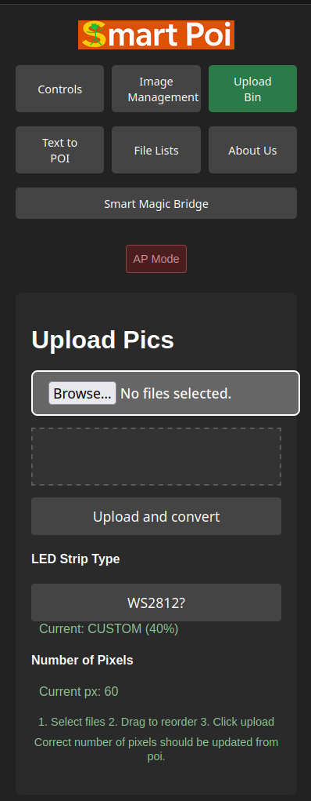{width=45%}
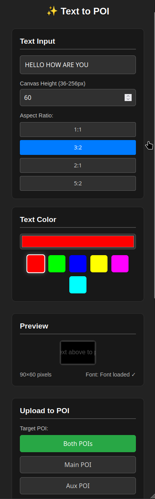{width=45%}
:::
### File Selection
1. Click "Browse" to select image files (multiple selection supported)
2. Selected files appear in a draggable list

### File Reordering
- Drag files up/down in the list to change upload order
- Files are uploaded in the order shown

### LED Configuration
- **LED Strip Type**: Toggle between APA102, WS2812, or CUSTOM
- **Number of Pixels**: Adjust pixel count (automatically detected from POI)
- **Custom Compression**: When CUSTOM is selected, a compression settings dialog (20-80%) appears

### Upload Process
1. Select files
2. Reorder if desired
3. Click **Upload and convert**
4. Files are converted and uploaded to POI

---

## Text to POI Tab
::: {style="display: flex;"}
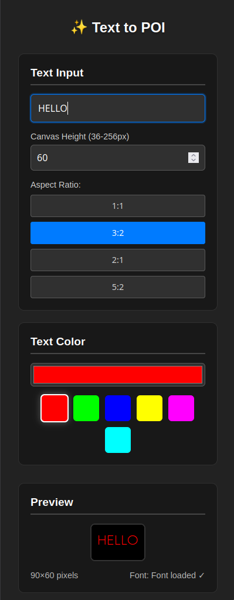{width=45%}
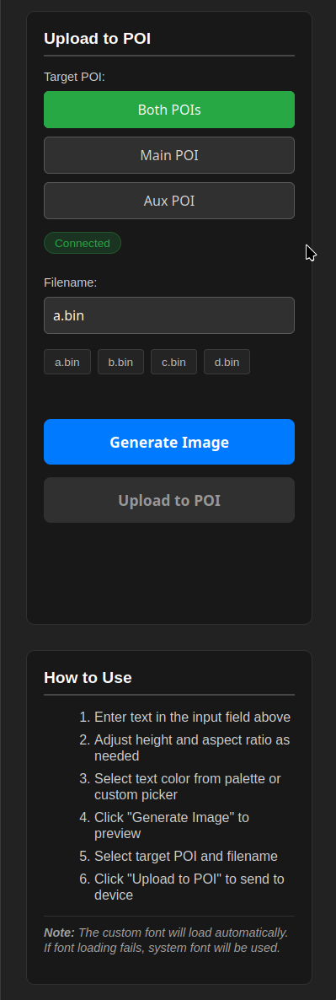{width=45%}
:::

### Text Creation
1. **Enter Text**: Type your message in the text input field
2. **Adjust Height**: Set canvas height (choose your actual POI size)
3. **Select Aspect Ratio**: Choose from 1:1, 3:2, 2:1, or 5:2
4. **Choose Color**:
   - Use color picker for custom colors
   - Click color swatches for presets (red, green, blue, yellow, magenta, cyan)

### Preview
- Generated text appears on the canvas in real-time
- Canvas dimensions display below preview
- Font loading status shown (custom or system font)

### Upload Configuration
1. **Target POI**: Select Both, Main, or Aux POI
2. **Filename**: Choose from suggestions (a.bin, b.bin, c.bin, d.bin) or enter custom name
3. **Connection Status**: Shows if POI is reachable

### Upload Process
1. Click **Generate Image** to create preview
2. Verify text appearance
3. Click **Upload to POI** to send to selected device(s)

### NOTE:
- Text to POI works in AP Mode only!

---

## File Lists Tab
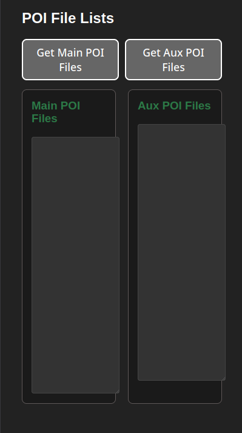

### Viewing Files
- **Get Main POI Files**: Display all files stored on Main POI
- **Get Aux POI Files**: Display all files stored on Aux POI

### File Information
File lists show:
- Image files (.bin format)
- Configuration files
- System files

---

## About Us Tab
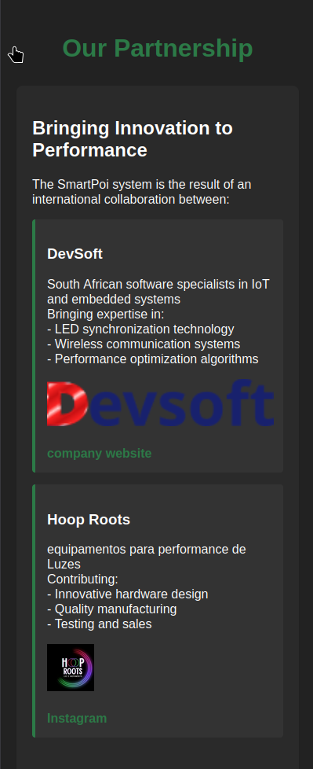

### Partnership Information
Learn about the collaboration between:
- **DevSoft** (South Africa): IoT and embedded systems specialists
- **Hoop Roots** (Performance equipment): Hardware design and manufacturing

### Contact Information
- DevSoft website: [devsoft.co.za](https://devsoft.co.za)
- Hoop Roots website: [hoop-roots.com](https://hoop-roots.com)

---

## Smart Magic Bridge Tab
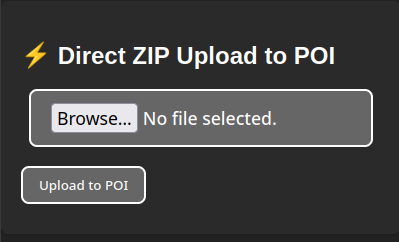

### Direct ZIP Upload
- ZIP files, create in [magicpoi.com](https://magicpoi.com) (patreon subscribers only)
- **[Sign up to Patreon here](https://patreon.com/c/CircusScientist)**
- Upload ZIP files directly to POIs without the need for individual file processing:
1. Click to select a ZIP file
2. File contents are listed for verification
3. Click **Upload to POI**
4. Progress and status displayed

### Clearing Uploads
- Click **Clear** to remove selected ZIP file

---

## Upgrading POI firmware (ESP32 version only)
**[Subscribe to Patreon](https://patreon.com/c/CircusScientist)** to receive the latest firmware updates 
- connect to poi 
- open web browser
- visit [http://192.168.1.78/update](http://192.168.1.78/update) (Auxillary) and
- [http://192.168.1.1/update](http://192.168.1.1/update) (Main) 
- update Auxillary, then Main (choose correct downloaded .bin file)
- usually filesystem does not need upgrading (check release notes)
- ***Router mode: use actual poi IP***
- ***Make sure to not upload Auxillary Firmware to Main Poi by mistake!!***

---

## Tips and Best Practices

### General
- Keep POIs and control device on the same Wi-Fi network
- Use the **Fetch Settings** button to verify connection
- Start with lower brightness settings and increase as needed (SmartPoi always start up with Brightness 20 to save battery)

### Image Management
- Regularly back up important images
- 1000's of poi images available from [magicpoi.com](https://magicpoi.com)
([Patreon subscription](https://patreon.com/c/CircusScientist) required)
### Text Creation
- Shorter text works better with limited pixel displays
- Use high-contrast colors for better visibility
- Test aspect ratios to find optimal text fit

### Troubleshooting
- If POIs don't appear, check Wi-Fi connection and indicator lights
- Use manual IP configuration if automatic discovery fails
- Restart POIs if connection issues persist

---

*Last updated: [9 April 2026]*
*SmartPoi Controls Version: [1.0.4]*